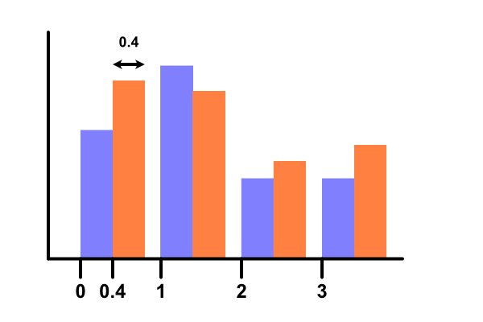
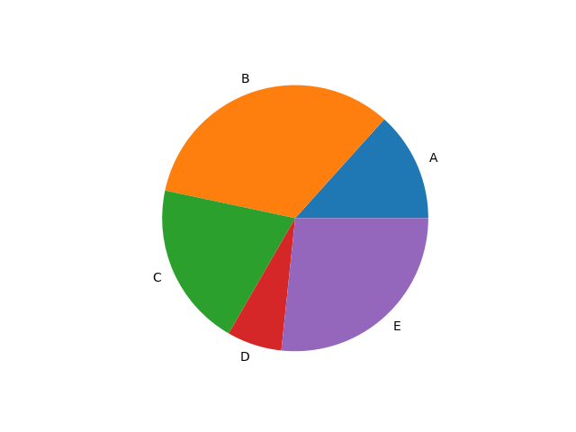
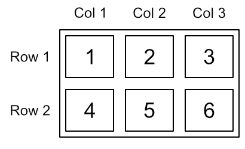

# Matplotlib example code

2009-rain-daily.csv
2009-rain-monthly.csv
2009-temp-daily.csv
2009-temp-monthly.csv
2009-temp-monthly-list.csv
2010-rain-daily.csv
2010-rain-monthly.csv
2010-temp-daily.csv
2010-temp-monthly.csv

[2plot-temp-rain.py](2plot-temp-rain.py)

[2year-lineplot-monthly-temperatures.py](2year-lineplot-monthly-temperatures.py)

[barchart-color.py](barchart-color.py)
barchart-dual-1.afdesign

barchart-dual-2.afdesign

[barchart-dual.py](barchart-dual.py)

[barchart-error-bars.py](barchart-error-bars.py)
[barchart-errorbars.py](barchart-errorbars.py)

[barchart-horizontal.py](barchart-horizontal.py)

[barchart-label.py](barchart-label.py)

[barchart-monthly-temperatures-coded.py](barchart-monthly-temperatures-coded.py)

[barchart-monthly-temperatures-h.py](barchart-monthly-temperatures-h.py)

[barchart-monthly-temperatures-names.py](barchart-monthly-temperatures-names.py)

[barchart-monthly-temperatures.py](barchart-monthly-temperatures.py)

[barchart-monthly-temperatures-seasons.py](barchart-monthly-temperatures-seasons.py)

barchart-normal.afdesign

[barchart.py](barchart.py)

[barchart-stacked.py](barchart-stacked.py)
boxplot-description.afdesign

[boxplot-temperatures.py](boxplot-temperatures.py)

[histogram-temperatures-bins.py](histogram-temperatures-bins.py)

[histogram-temperatures.py](histogram-temperatures.py)

[linestyles.py](linestyles.py)

[markerstyles.py](markerstyles.py)

[numpy-function.py](numpy-function.py)

[piechart-donut.py](piechart-donut.py)

[piechart-explode.py](piechart-explode.py)

[piechart-nested.py](piechart-nested.py)

[piechart.py](piechart.py)

[piechart-styling.py](piechart-styling.py)
quartiles.afdesign

readme.md

[scatter-temp-color.py](scatter-temp-color.py)

[scatter-temp.py](scatter-temp.py)

[scatter-temp-rain.py](scatter-temp-rain.py)

[simple-function.py](simple-function.py)

[simple-list.py](simple-list.py)

[stemplot-monthly-temperatures-names.py](stemplot-monthly-temperatures-names.py)

subplot.afdesign

[temperature-plot.py](temperature-plot.py)

[violinplot-temperatures.py](violinplot-temperatures.py)
