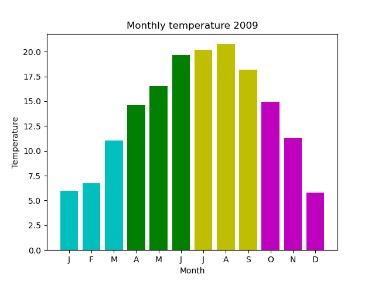

# Matplotlib example code

Code examples using Matplotlib to create various types of graph. Each example is self contained. Requires Matplotlib and NumPy.

For explanations of the code see [pythoninformer.com](https://pythoninformer.com/python-libraries/matplotlib/),

## Data

Many examples use real data relating to the temperatures and rainfall figures for the UK in 2009/2010.  The data sets are derived from public sector information licensed under the Open Government Licence v3.0. The data has been cleaned and saved as CSV files in this folder:

* [2009-rain-daily.csv](2009-rain-daily.csv)
* [2009-rain-monthly.csv](2009-rain-monthly.csv)
* [2009-temp-daily.csv](2009-temp-daily.csv)
* [2009-temp-monthly.csv](2009-temp-monthly.csv)
* [2009-temp-monthly-list.csv](2009-temp-monthly-list.csv)
* [2010-rain-daily.csv](2010-rain-daily.csv)
* [2010-rain-monthly.csv](2010-rain-monthly.csv)
* [2010-temp-daily.csv](2010-temp-daily.csv)
* [2010-temp-monthly.csv](2010-temp-monthly.csv)

See https://pythoninformer.com/python-libraries/matplotlib/data-and-code/

## Simple plots

See https://pythoninformer.com/python-libraries/matplotlib/simple-plot/

[simple-list.py](simple-list.py)

[simple-function.py](simple-function.py)

## Simple plot using NumPy

See https://pythoninformer.com/python-libraries/matplotlib/numpy-plot/

[numpy-function.py](numpy-function.py)

## Line plots

See https://pythoninformer.com/python-libraries/matplotlib/line-plots/

[temperature-plot.py](temperature-plot.py)

See https://pythoninformer.com/python-libraries/matplotlib/multiple-line-plots/

[2year-lineplot-monthly-temperatures.py](2year-lineplot-monthly-temperatures.py)

## Scatter plots

See https://pythoninformer.com/python-libraries/matplotlib/scatter-plots/

[scatter-temp-rain.py](scatter-temp-rain.py)

[scatter-temp.py](scatter-temp.py)

[scatter-temp-color.py](scatter-temp-color.py)

## Line and marker styles

See https://pythoninformer.com/python-libraries/matplotlib/styling-lines-and-markers/

[linestyles.py](linestyles.py)

[markerstyles.py](markerstyles.py)

## Subplots

See https://pythoninformer.com/python-libraries/matplotlib/subplots/

[2plot-temp-rain.py](2plot-temp-rain.py)

## Bar charts

See https://pythoninformer.com/python-libraries/matplotlib/barcharts/

[barchart-monthly-temperatures.py](barchart-monthly-temperatures.py)

[barchart-monthly-temperatures-names.py](barchart-monthly-temperatures-names.py)

[barchart-monthly-temperatures-h.py](barchart-monthly-temperatures-h.py)

[2year-barchart-monthly-temperatures.py](2year-barchart-monthly-temperatures.py)

## Colouring barcharts

See https://pythoninformer.com/python-libraries/matplotlib/data-colouring-barcharts/

[barchart-monthly-temperatures-seasons.py](barchart-monthly-temperatures-seasons.py)

[barchart-monthly-temperatures-coded.py](barchart-monthly-temperatures-coded.py)

## Other barcharts

[barchart-color.py](barchart-color.py)

[barchart-horizontal.py](barchart-horizontal.py)

[barchart-stacked.py](barchart-stacked.py)

## Pie charts

See https://pythoninformer.com/python-libraries/matplotlib/piecharts/

[piechart-donut.py](piechart-donut.py)

[piechart-explode.py](piechart-explode.py)

[piechart-nested.py](piechart-nested.py)

[piechart.py](piechart.py)

[piechart-styling.py](piechart-styling.py)

## Stem plots

See https://pythoninformer.com/python-libraries/matplotlib/stemplots/

[stemplot-monthly-temperatures-names.py](stemplot-monthly-temperatures-names.py)

## Error bars

See https://pythoninformer.com/python-libraries/matplotlib/error-bars/

[barchart-error-bars.py](barchart-error-bars.py)

## Histograms

See https://pythoninformer.com/python-libraries/matplotlib/histograms/

[histogram-temperatures-bins.py](histogram-temperatures-bins.py)

[histogram-temperatures.py](histogram-temperatures.py)

## Box plots

See https://pythoninformer.com/python-libraries/matplotlib/boxplots/

[boxplot-temperatures.py](boxplot-temperatures.py)

## Violin plots

See https://pythoninformer.com/python-libraries/matplotlib/violinplots/

[violinplot-temperatures.py](violinplot-temperatures.py)
